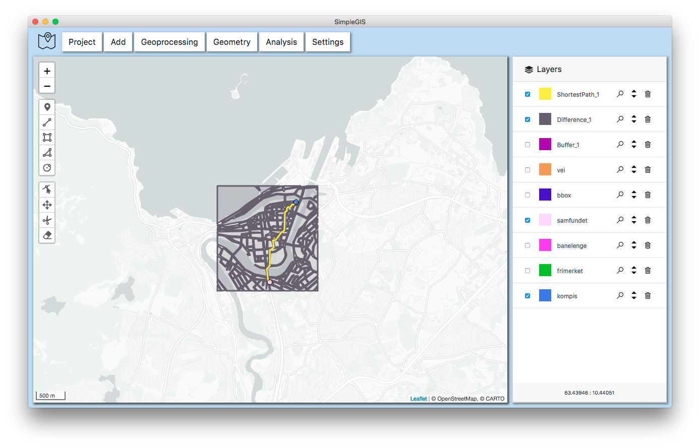

#  SimpleGIS

This repository contains the source code for the SimpleGIS application,
developed for the course TBA4251.

Go to [releases](https://github.com/Carliss/SimpleGIS/releases) to download the application.

